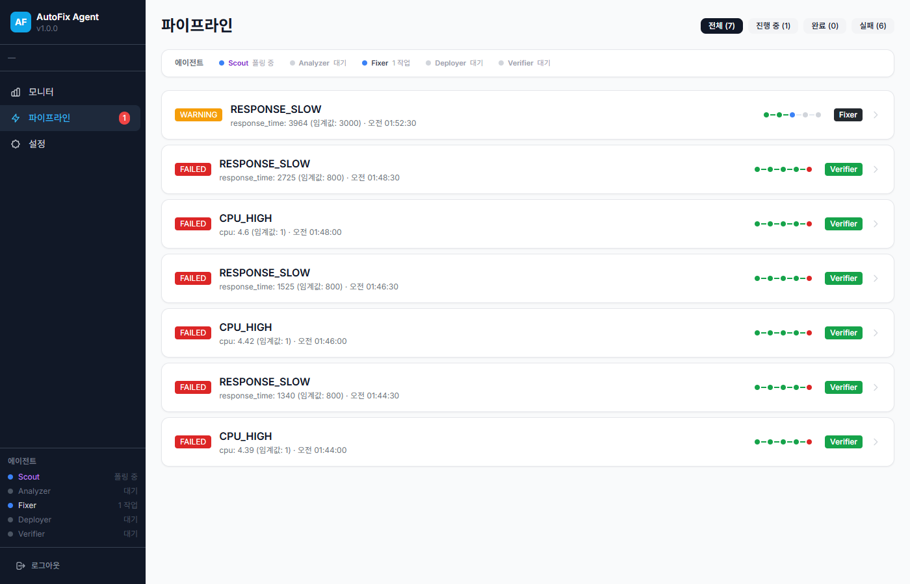

# AutoFix Agent

WhaTap 모니터링에서 이상을 감지하면 **자동으로 원인 분석 → 수정안 생성 → 배포 → 검증**까지 수행하는 AI 에이전트 파이프라인입니다.



## Quick Start

> **Java 17 이상**이 설치되어 있어야 합니다. (`java -version`으로 확인)

```bash
# 1. 클론
git clone https://github.com/devload/whatap-autofix.git
cd whatap-autofix

# 2. 실행 (빌드 + 서버 시작을 한 번에)
./gradlew bootRun

# 3. 브라우저에서 접속
open http://localhost:8095
```

로그인 화면에서 **WhaTap 이메일/비밀번호** 또는 **API Key**를 입력하면 바로 모니터링이 시작됩니다.

### AI 분석 설정 (택 1)

| 방식 | 설정 | 토큰 필요 |
|------|------|-----------|
| **Claude Code (Local)** | Claude Code CLI 설치 후 provider를 `claude-local`로 선택 | 불필요 |
| **GLM (Zhipu AI)** | 설정 화면에서 GLM API 토큰 입력 | GLM 토큰 |
| **SessionCast Relay** | SessionCast 에이전트 토큰 입력 | SessionCast 토큰 |
| **없음** | AI 미연결 시 규칙 기반 폴백 분석 자동 수행 | 불필요 |

#### Claude Code (Local) — 가장 간단

로컬에 [Claude Code](https://claude.ai/claude-code)가 설치되어 있으면 토큰 없이 바로 AI 분석을 사용할 수 있습니다.

```bash
# Claude Code 설치 확인
claude --version

# SessionCast CLI 설치 (선택 — 미설치 시 서버 시작할 때 자동 설치됨)
# macOS / Linux
eval "$(curl -fsSL https://raw.githubusercontent.com/sessioncast/sessioncast-cli-release/main/install.sh)"

# Windows (PowerShell)
irm https://raw.githubusercontent.com/sessioncast/sessioncast-cli-release/main/install.ps1 | iex
```

#### GLM (Zhipu AI) — 기본값

GLM API 토큰만 입력하면 됩니다. 웹 UI의 설정 화면에서 입력하거나, `.env` 파일에 설정:

```bash
# .env 파일 생성 (git에 커밋되지 않음)
echo "GLM_API_TOKEN=your_glm_token" >> .env
./gradlew bootRun   # .env 자동 로드
```

---

## 시스템 요구사항

| 항목 | 최소 | 권장 |
|------|------|------|
| **Java** | 17 | 21 |
| **OS** | macOS, Linux, Windows | - |
| **메모리** | 512MB | 1GB |
| **네트워크** | WhaTap API 접근 가능 | - |

### Java 설치 확인

```bash
java -version
# openjdk version "17.x.x" 이상이면 OK
```

Java가 없다면:
- **macOS**: `brew install openjdk@17`
- **Ubuntu/Debian**: `sudo apt install openjdk-17-jdk`
- **Windows**: [Adoptium](https://adoptium.net/) 에서 다운로드
- **SDKMAN**: `sdk install java 17.0.13-tem`

---

## 주요 기능

| 에이전트 | 역할 | 설명 |
|---------|------|------|
| **Scout** | 이상 감지 | WhaTap API에서 30초 간격 메트릭 폴링, 임계값 초과 시 파이프라인 자동 생성 |
| **Analyzer** | 원인 분석 | AI(Claude/GLM)로 시계열 연관 분석, 인과관계 체인, 분석 과정 단계별 서술 |
| **Fixer** | 수정안 생성 | AI가 Tailwind CSS HTML 카드로 즉시 조치 + 설정 변경 코드 생성 |
| **Deployer** | 배포 | GitHub 연동 시 실제 배포, 미연동 시 시뮬레이션 모드 |
| **Verifier** | 결과 검증 | Before/After 메트릭 비교, PASS/FAIL 판정 + Webhook 알림 |

### AI 연관 분석

단일 메트릭이 아니라 **시계열 추이 + 메트릭 간 인과관계**를 분석합니다:

- 시계열 히스토리 기반 트렌드 감지 (최근 10건, 약 5분)
- 1차 인과 + 2차 파급 메트릭 체인 (`user → tps → actx → cpu → rtime → apdex`)
- 분석 과정(reasoning) 단계별 서술
- 사용자 피드백 → 다음 분석에 반영 (학습 루프)

### 알림 에스컬레이션

Verifier가 FAIL 판정 시 Webhook으로 알림을 전송합니다 (Slack 호환).
설정 화면에서 Webhook URL을 등록하면 활성화됩니다.

### 지원 이슈 유형

`CPU_HIGH` `MEMORY_HIGH` `ERROR_SPIKE` `RESPONSE_SLOW` `DISK_FULL` `DB_POOL_EXHAUSTED`

---

## 기술 스택

- **Backend:** Spring Boot 3.2.5, Java 17, WebFlux
- **Frontend:** Vanilla HTML/JS, Tailwind CSS
- **AI 분석:** Claude Code (Local) / GLM (Zhipu AI) / SessionCast Relay
- **모니터링:** WhaTap Open API + MXQL
- **배포:** GitHub API (선택), 시뮬레이션 모드 (기본)

---

## 상세 설치 가이드

### 방법 1: Gradle로 실행 (개발용, 권장)

```bash
git clone https://github.com/devload/whatap-autofix.git
cd whatap-autofix
./gradlew bootRun
```

`.env` 파일이 있으면 환경변수가 자동으로 로드됩니다.

### 방법 2: JAR로 실행 (배포용)

```bash
git clone https://github.com/devload/whatap-autofix.git
cd whatap-autofix
./gradlew bootJar
java -jar build/libs/autofix-agent-0.1.0-SNAPSHOT.jar
```

---

## Docker 배포

### Docker Build & Run

```bash
# 빌드
docker build -t autofix-agent .

# 실행
docker run -d \
  --name autofix-agent \
  -p 8095:8095 \
  -e WHATAP_API_TOKEN=your_whatap_api_token \
  -e WHATAP_PCODE=your_project_pcode \
  -e SESSIONCAST_TOKEN=your_sessioncast_token \
  autofix-agent
```

### Docker Compose

`.env` 파일을 생성합니다:

```env
WHATAP_API_TOKEN=your_whatap_api_token
WHATAP_PCODE=your_project_pcode
SESSIONCAST_TOKEN=your_sessioncast_token
# GITHUB_TOKEN=your_github_token
# GITHUB_OWNER=your_github_username
# GITHUB_REPO=your_repo_name
```

실행:

```bash
docker compose up -d
```

---

## 환경변수

| 변수 | 필수 | 설명 |
|------|------|------|
| `GLM_API_TOKEN` | - | GLM (Zhipu AI) API 토큰 |
| `WHATAP_DEFAULT_EMAIL` | - | WhaTap 로그인 기본값 (개발용) |
| `WHATAP_DEFAULT_PASSWORD` | - | WhaTap 비밀번호 기본값 (개발용) |
| `SESSIONCAST_TOKEN` | - | SessionCast Relay 에이전트 토큰 |
| `GITHUB_TOKEN` | - | GitHub Personal Access Token (실제 배포 모드) |
| `GITHUB_OWNER` | - | GitHub 저장소 소유자 |
| `GITHUB_REPO` | - | GitHub 저장소 이름 |

> 모든 환경변수는 선택사항입니다. `.env` 파일에 넣으면 `./gradlew bootRun` 시 자동 로드됩니다.
> AI 미연결 시에도 규칙 기반 폴백 분석으로 동작합니다.

## 임계값 설정

기본 임계값은 `application.yml`에 정의되어 있으며, 웹 UI의 **설정** 페이지에서 런타임 변경이 가능합니다.

| 메트릭 | 기본값 | 설명 |
|--------|--------|------|
| CPU | 95% | CPU 사용률 |
| Memory | 85% | 메모리 사용률 |
| Disk | 85% | 디스크 사용률 |
| Error Rate | 3.0% | 에러율 |
| Response Time | 3000ms | 평균 응답 시간 |
| TPS Drop | 0.5 | TPS 감소 비율 |

---

## 파이프라인 흐름

```
Scout(이상 감지) → Analyzer(원인 분석) → Fixer(수정안) → Deployer(배포) → Verifier(검증)
     ↑                                                                           |
     └─────────────────── 3초 간격 폴링 ──────────────────────────────────────────┘
```

1. **Scout** — WhaTap에서 메트릭 수집, 임계값 초과 시 이슈 생성
2. **Analyzer** — AI(Claude/GLM)로 시계열 연관 분석, 인과관계 체인 + 분석 과정 단계별 서술
3. **Fixer** — AI가 Tailwind CSS HTML 카드로 즉시 조치 + 설정 변경 코드 생성
4. **Deployer** — GitHub 연동 시 실제 배포, 미연동 시 시뮬레이션
5. **Verifier** — Before/After 메트릭 비교로 해결 여부 판정, Webhook 알림 발송

---

## 프로젝트 구조

```
autofix-agent/
├── src/main/java/io/sessioncast/autofix/
│   ├── AutofixApplication.java        # 메인 엔트리포인트
│   ├── agent/                         # 5단계 에이전트
│   │   ├── ScoutAgent.java
│   │   ├── AnalyzerAgent.java
│   │   ├── FixerAgent.java
│   │   ├── DeployerAgent.java
│   │   └── VerifierAgent.java
│   ├── client/                        # 외부 API 클라이언트
│   │   ├── WhatapApiClient.java
│   │   ├── WhatapAuthClient.java
│   │   ├── GithubApiClient.java
│   │   └── SessionCastClient.java
│   ├── controller/                    # REST API
│   ├── model/                         # 데이터 모델
│   ├── rule/                          # 규칙 엔진
│   ├── config/                        # 설정
│   └── service/                       # 서비스
│       ├── GlmService.java           # GLM (Zhipu AI) 직접 API
│       ├── ClaudeLocalService.java   # Claude Code 로컬 CLI 호출
│       ├── FeedbackService.java      # 분석 피드백 루프
│       ├── WebhookService.java       # Webhook 알림 (Slack 호환)
│       └── PipelineService.java      # 파이프라인 관리
├── src/main/resources/
│   ├── application.yml                # 애플리케이션 설정
│   ├── rules/default-rules.yml        # 기본 규칙
│   └── static/                        # 프론트엔드 (HTML/JS/CSS)
├── docs/
│   ├── user-guide.html                # 사용자 가이드
│   └── guide-screenshots/             # 스크린샷
├── Dockerfile
├── docker-compose.yml
└── build.gradle
```

---

## 사용자 가이드

상세한 사용 방법은 [사용자 가이드](docs/user-guide.html)를 참고하세요.

웹 UI 주요 화면:

| 화면 | 설명 |
|------|------|
| **로그인** | WhaTap 계정 연결 |
| **프로젝트 선택** | 모니터링 대상 프로젝트 선택 |
| **모니터** | 실시간 메트릭 대시보드, Scout 로그 |
| **파이프라인** | 자동 수정 파이프라인 목록 및 상세 |
| **설정** | 연결 상태, AI 제공자, 임계값, 데이터 관리 |

---

## 라이선스

MIT License
