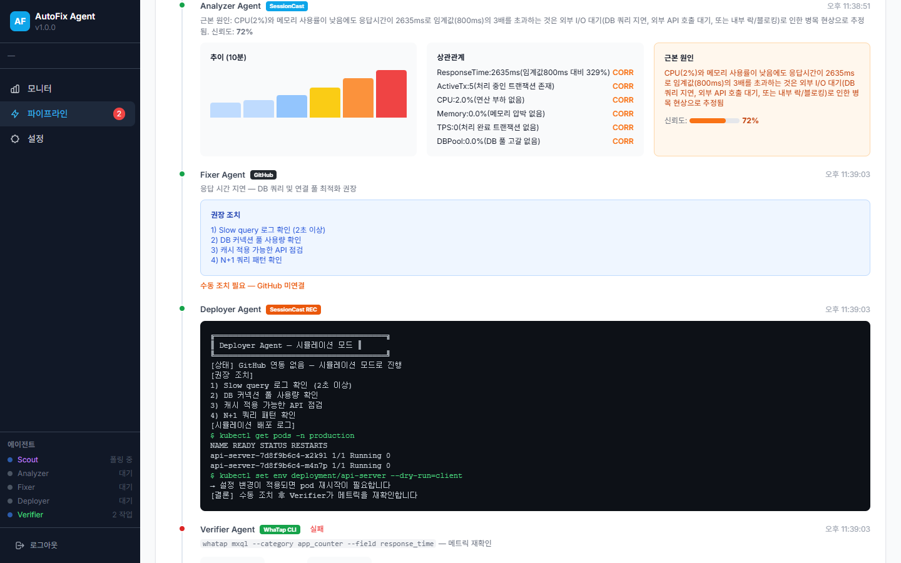
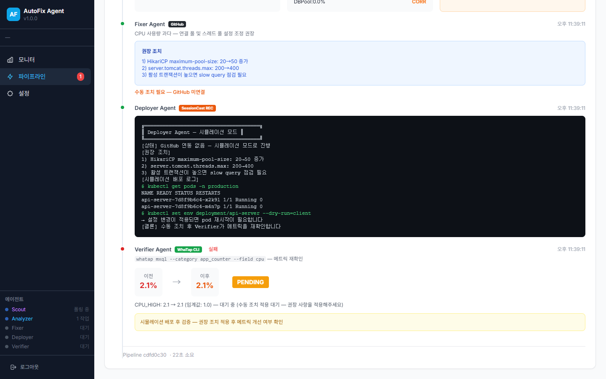

# AutoFix Agent

WhaTap 모니터링에서 이상을 감지하면 **자동으로 원인 분석 → 수정안 생성 → 배포 → 검증**까지 수행하는 AI 에이전트 파이프라인입니다.


## 주요 기능

| 에이전트 | 역할 | 설명 |
|---------|------|------|
| **Scout** | 이상 감지 | WhaTap API에서 3초 간격 메트릭 폴링, 임계값 초과 시 파이프라인 자동 생성 |
| **Analyzer** | 원인 분석 | SessionCast Relay → Claude Code(LLM)로 한국어 근본 원인 분석 |
| **Fixer** | 수정안 생성 | 코드 diff 또는 권장 조치 목록 생성 |
| **Deployer** | 배포 | GitHub 연동 시 실제 배포, 미연동 시 시뮬레이션 모드 |
| **Verifier** | 결과 검증 | Before/After 메트릭 비교, PASS/FAIL 자동 판정 |

### 지원 이슈 유형

- `CPU_HIGH` — CPU 사용률 과다
- `MEMORY_HIGH` — 메모리 사용률 과다
- `ERROR_SPIKE` — 에러율 급증
- `RESPONSE_SLOW` — 응답 시간 지연
- `DISK_FULL` — 디스크 용량 부족
- `DB_POOL_EXHAUSTED` — DB 커넥션 풀 고갈

## AI 분석 예시



SessionCast Relay를 통해 Claude Code가 한국어로 근본 원인, 상관 메트릭, 신뢰도, 권장 조치를 분석합니다.

## 시뮬레이션 모드

GitHub 미연동 시 자동으로 시뮬레이션 모드로 동작합니다. 실제 메트릭 수집과 AI 분석은 동일하게 수행되며, 배포만 시뮬레이션으로 대체됩니다.



---

## 기술 스택

- **Backend:** Spring Boot 3.2.5, Java 17, WebFlux
- **Frontend:** Vanilla HTML/JS, Tailwind CSS
- **AI 분석:** SessionCast Relay → Claude Code / Codex CLI / Gemini CLI
- **모니터링:** WhaTap Open API
- **배포:** GitHub API (선택), 시뮬레이션 모드 (기본)

---

## 시작하기

### 사전 요구사항

- Java 17+
- WhaTap 계정 (API 토큰 + 프로젝트 코드)
- (선택) SessionCast 에이전트 토큰 — AI 분석용
- (선택) GitHub 토큰 — 실제 배포 모드용

### 로컬 실행

```bash
# 1. 빌드
./gradlew bootJar

# 2. 환경변수 설정
export WHATAP_API_TOKEN=your_whatap_api_token
export WHATAP_PCODE=your_project_pcode

# (선택) SessionCast — AI 분석 활성화
export SESSIONCAST_TOKEN=your_sessioncast_token

# (선택) GitHub — 실제 배포 모드
export GITHUB_TOKEN=your_github_token
export GITHUB_OWNER=your_github_username
export GITHUB_REPO=your_repo_name

# 3. 실행
java -jar build/libs/autofix-agent-0.1.0-SNAPSHOT.jar
```

브라우저에서 http://localhost:8095 접속 후 WhaTap 계정으로 로그인합니다.

### Gradle로 직접 실행

```bash
WHATAP_API_TOKEN=your_token WHATAP_PCODE=12345 ./gradlew bootRun
```

---

## Docker 배포

### Docker Build & Run

```bash
# 빌드
docker build -t autofix-agent .

# 실행
docker run -d \
  --name autofix-agent \
  -p 8095:8095 \
  -e WHATAP_API_TOKEN=your_whatap_api_token \
  -e WHATAP_PCODE=your_project_pcode \
  -e SESSIONCAST_TOKEN=your_sessioncast_token \
  autofix-agent
```

### Docker Compose

`.env` 파일을 생성합니다:

```env
WHATAP_API_TOKEN=your_whatap_api_token
WHATAP_PCODE=your_project_pcode
SESSIONCAST_TOKEN=your_sessioncast_token
# GITHUB_TOKEN=your_github_token
# GITHUB_OWNER=your_github_username
# GITHUB_REPO=your_repo_name
```

실행:

```bash
docker compose up -d
```

---

## 환경변수

| 변수 | 필수 | 설명 |
|------|------|------|
| `WHATAP_API_TOKEN` | O | WhaTap Open API 토큰 |
| `WHATAP_PCODE` | O | WhaTap 프로젝트 코드 |
| `SESSIONCAST_TOKEN` | - | SessionCast 에이전트 토큰 (AI 분석용) |
| `SESSIONCAST_RELAY_URL` | - | SessionCast Relay URL (기본: `wss://relay.sessioncast.io/ws`) |
| `GITHUB_TOKEN` | - | GitHub Personal Access Token (실제 배포 모드) |
| `GITHUB_OWNER` | - | GitHub 저장소 소유자 |
| `GITHUB_REPO` | - | GitHub 저장소 이름 |

> SessionCast 토큰 없이도 동작합니다. AI 분석 대신 규칙 기반 폴백 분석이 수행됩니다.

## 임계값 설정

기본 임계값은 `application.yml`에 정의되어 있으며, 웹 UI의 **설정** 페이지에서 런타임 변경이 가능합니다.

| 메트릭 | 기본값 | 설명 |
|--------|--------|------|
| CPU | 95% | CPU 사용률 |
| Memory | 85% | 메모리 사용률 |
| Disk | 85% | 디스크 사용률 |
| Error Rate | 3.0% | 에러율 |
| Response Time | 3000ms | 평균 응답 시간 |
| TPS Drop | 0.5 | TPS 감소 비율 |

---

## 파이프라인 흐름

```
Scout(이상 감지) → Analyzer(원인 분석) → Fixer(수정안) → Deployer(배포) → Verifier(검증)
     ↑                                                                           |
     └─────────────────── 3초 간격 폴링 ──────────────────────────────────────────┘
```

1. **Scout** — WhaTap에서 메트릭 수집, 임계값 초과 시 이슈 생성
2. **Analyzer** — LLM(Claude Code)으로 근본 원인 분석, 상관 메트릭 식별
3. **Fixer** — 이슈 유형에 따라 코드 수정 diff 또는 권장 조치 생성
4. **Deployer** — GitHub 연동 시 실제 배포, 미연동 시 시뮬레이션
5. **Verifier** — Before/After 메트릭 비교로 해결 여부 판정

---

## 프로젝트 구조

```
autofix-agent/
├── src/main/java/io/sessioncast/autofix/
│   ├── AutofixApplication.java        # 메인 엔트리포인트
│   ├── agent/                         # 5단계 에이전트
│   │   ├── ScoutAgent.java
│   │   ├── AnalyzerAgent.java
│   │   ├── FixerAgent.java
│   │   ├── DeployerAgent.java
│   │   └── VerifierAgent.java
│   ├── client/                        # 외부 API 클라이언트
│   │   ├── WhatapApiClient.java
│   │   ├── WhatapAuthClient.java
│   │   ├── GithubApiClient.java
│   │   └── SessionCastClient.java
│   ├── controller/                    # REST API
│   ├── model/                         # 데이터 모델
│   ├── rule/                          # 규칙 엔진
│   ├── config/                        # 설정
│   └── service/                       # 서비스
├── src/main/resources/
│   ├── application.yml                # 애플리케이션 설정
│   ├── rules/default-rules.yml        # 기본 규칙
│   └── static/                        # 프론트엔드 (HTML/JS/CSS)
├── docs/
│   ├── user-guide.html                # 사용자 가이드
│   └── guide-screenshots/             # 스크린샷
├── Dockerfile
├── docker-compose.yml
└── build.gradle
```

---

## 사용자 가이드

상세한 사용 방법은 [사용자 가이드](docs/user-guide.html)를 참고하세요.

웹 UI 주요 화면:

| 화면 | 설명 |
|------|------|
| **로그인** | WhaTap 계정 연결 |
| **프로젝트 선택** | 모니터링 대상 프로젝트 선택 |
| **모니터** | 실시간 메트릭 대시보드, Scout 로그 |
| **파이프라인** | 자동 수정 파이프라인 목록 및 상세 |
| **설정** | 연결 상태, AI 제공자, 임계값, 데이터 관리 |

---

## 라이선스

MIT License
